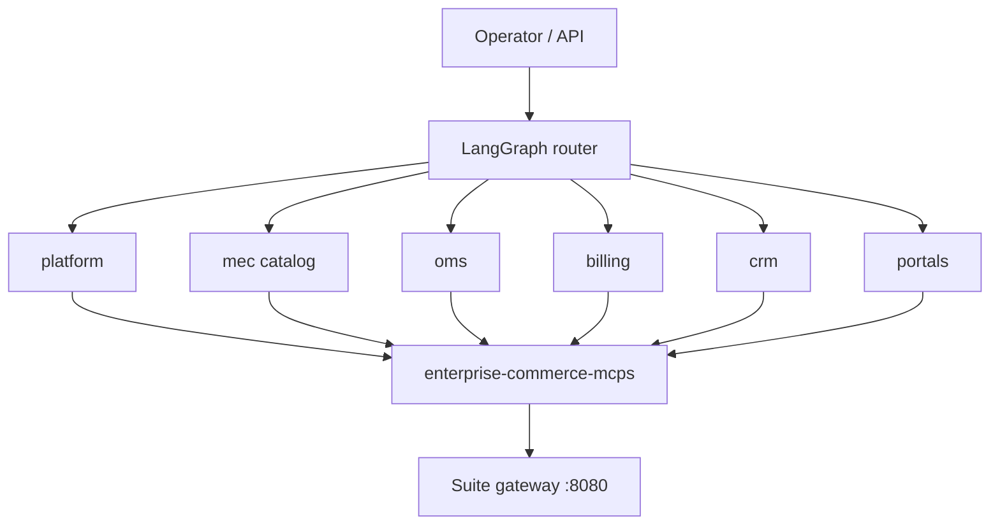

# Enterprise Commerce Agents

Public open-source project owned by **Pawan Gunjkar** (`pawangunjkar@gmail.com` · [GitHub](https://github.com/Pawangunjkar)). MIT licensed. See `OWNER.md` and `LICENSE`.

Standalone **Python + LangGraph** project. It is **not** inside `enterprise-commerce-suite` and it is **not** a FAQ chatbot.

Agents are **operators**. They call the sibling [enterprise-commerce-mcps](https://github.com/Pawangunjkar/enterprise-commerce-mcps) FastMCP servers, which in turn hit live Enterprise Commerce Suite APIs. If a service is down, the agent returns the MCP/HTTP error — it does not invent an answer.

Layout: **one domain → many applications → one or more agents per application** (matching that app's business jobs). Cross-app **journey** squads still exist for playbooks such as Delhi UPI checkout.



`ecs-agents list-agents` prints the full tree. Counts: **54 applications**, **multiple specialists per app** where the MCP exposes more than one job (for example `product-service` has browse + lifecycle; `gst-tax-engine` has compute + e-way bill; `order-orchestrator` has checkout saga + merchandising).


Named **scenarios** run the same MCP tools in a fixed playbook (no LLM required). Chat uses LangGraph ReAct when `OPENAI_API_KEY` is set.

## Install

```bash
cd enterprise-commerce-mcps
python -m venv .venv
.venv\Scripts\activate
pip install -e .

cd ..\enterprise-commerce-agents
pip install -e ".[dev]"
copy .env.example .env
```

Start the suite (infra + at least gateway, pincode, product, GST, ATP, orders, payments, invoices). Point agents at the gateway:

```
ECS_GATEWAY_URL=http://localhost:8080
ECS_SERVICE_URL=http://localhost:8080
```

## Run live scenarios (no LLM)

```bash
ecs-agents list-agents
ecs-agents list-agents --domain oms
ecs-agents list-agents --application gst-tax-engine
ecs-agents list-scenarios

ecs-agents run checkout-delhi-upi
ecs-agents run gst-interstate-eway
ecs-agents run merchandising-upsell
ecs-agents run fulfillment-atp-wave
ecs-agents run billing-invoice-dunning
ecs-agents run crm-otp-ticket-loyalty
```

Each step prints the JSON returned by MCP (orders, tax type, remaining stock, QR payload, etc.).

## LangGraph chat

```bash
set OPENAI_API_KEY=...
ecs-agents chat "Place a UPI order to 110001 for the 8GB phone and show GST"
```

Without an API key, chat only routes to an agent and tells you which scenario to run.

## HTTP API

```bash
ecs-agents serve --port 8099
```

- `GET /v1/agents?domain=oms&application=order-orchestrator`
- `GET /v1/domains`
- `GET /v1/scenarios`
- `POST /v1/chat` `{"message":"..."}`
- `POST /v1/scenarios/{id}/run`

## Layout

- `src/ecs_agents/catalog.py` — domain / application / specialist catalog
- `src/ecs_agents/registry.py` — routing and tree listing
- `src/ecs_agents/mcp_hub.py` — stdio MCP client (`python -m ecs_mcps.<server>`)
- `src/ecs_agents/graph.py` — LangGraph router + ReAct specialists
- `src/ecs_agents/scenarios.py` — playbook runner with `$.step.field` bindings
- `scenarios/*.yaml` — Indian commerce jobs

OMS recommendations (`POST /api/v1/recommendations`) are exposed as `suite.recommend_skus` until that route is regenerated into the order-orchestrator MCP.

## Owner

- Name: Pawan Gunjkar
- Email: pawangunjkar@gmail.com
- GitHub: https://github.com/Pawangunjkar
- Visibility: public open source (MIT)
